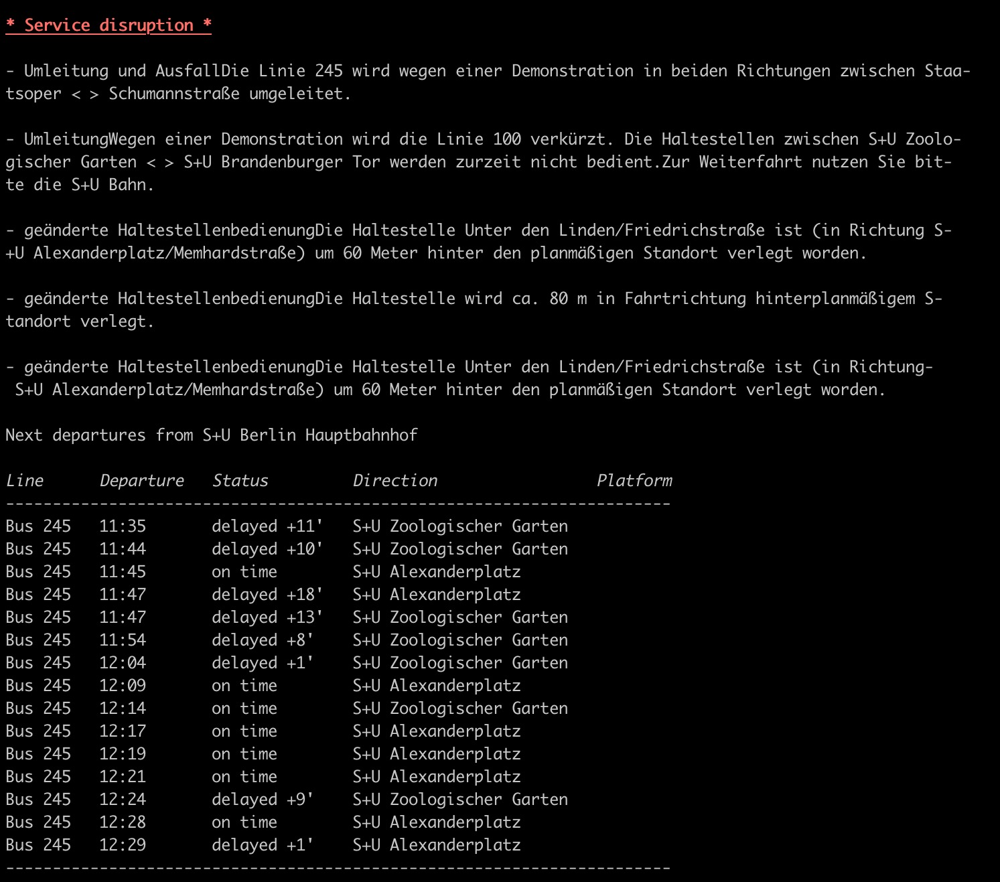

# zbb

**„zurück bleiben, bitte!“**

`zbb` is a CLI fetching the latest schedules for the [Berliner Verkehrsbetriebe (BVG)](https://www.bvg.de/en/Welcome).

It provides the latest disruptions and delays on your favorite lines while you enjoy the comfort of your terminal.

Here is an example of output for a search regarding the `Bus 245` from `Berlin Main Station`.

This looks like a bad commute!

## How does zzb work?

`zbb` works by scraping http://mobil.bvg.de

## Why?

- The `BVG` has an official API but developers need to officially apply to be granted an API key.
- I wanted to play with [Rust](https://www.rust-lang.org/).
- I actually need this :)

## Prior art

- *Lots* of projects have followed the same strategy to by-pass the need for an API key.
- `zbb` pretends by no mean to do something new nor original. 

## Usage

By default calling `zbb` without any arguments will start the interactive mode.
It consists in a series of questions to find out what you want.

If you want to repeat a query that you know to be valid, you can use the `fast` mode.

`-F, --fast <STATION> <LINE>    used to by-pass the interactive mode`

e.g. `zbb --fast Sonnenallee S42`

Then nothing prevents you from creating an alias :)

`alias next-train-home='zbb --fast Sonnenallee S42'`

## Installation

Binaries for `MacOS` are available in the `releases` section otherwise you can build the project using [Cargo](https://doc.rust-lang.org/stable/cargo/getting-started/installation.html)